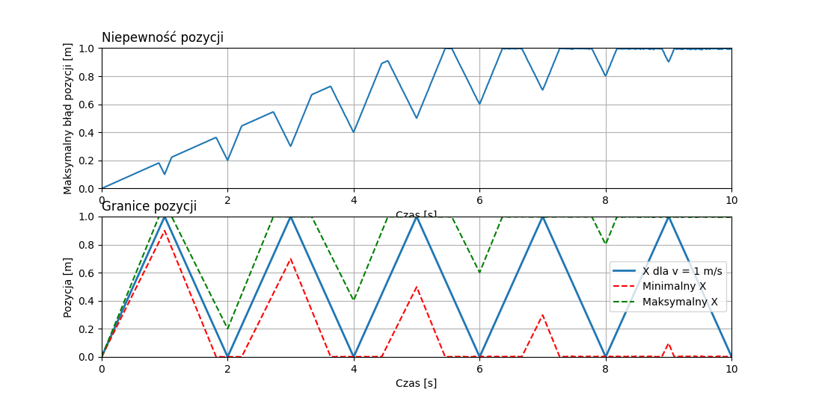

# Bouncing Balls
Czyli badanie wzrostu niepewności obliczeń wraz z upływem czasu na przykładzie sprężystej kulki odbijającej się pomiędzy dwiema sztywnymi ścianami.

## Zarys problemu


(W rozważaniach fizycznych kulkę będziemy traktować jako punkt materialny)

### Definicja
Kulka startuje przy ścianie A i jest wprawiona w ruch w kierunku ściany B z prędkością początkową v₀ ± δv. Z racji braku wszelkich oporów i strat energii w związku z założeniami, wartość prędkości będzie stała w czasie tewania doświadczenia. Zmieniać się będzie jednak zwrot wektora prędkości w wyniku odbicia się od którejkolwiek ściany. 

## Model komputerowy
### Wyliczanie x(t) przy danym v₀
Przyjmując odległość pomiędzy ścianami jako 1m i układ odniesienia z zerem przy ścianie A, możemy zauważyć parę rzeczy:
- Gdy łączna przebyta droga wyniesie 2m, to kula znajdzie się na pozycji początkowej.
- Po przebyciu kolejnych 2m stanie się tak samo. Czyli w ogólności zawsze kiedy s(t) = 2k \[m\] dla całkowitego k.

W ten sposób otrzymujemy pierwszą, aczkolwiek jeszcze niepoprawną, część naszego wzoru z wykorzystaniem operatora modulo: x(t) = vt mod 2 \[m\].
Nie otrzymaliśmy jeszcze poprawnego modelu sytuacji, nasza kula osiąga wartości w przedziale \[0,2), a nie \[0,1\]. Kluczem jest poprawnie zinterpretować przedział wartości \[1,2). Jest to moment, w którym odbiliśmy się już od drugiej ściany i wracamy na pozycję początkową. Zatem nasza poprawna pozycja w tym przypadku to: x(t) = 2 - vt mod 2 \[m\]. 
Łącząc obydwie obserwacje i biorąc przykład z [fal trójkątnych](https://en.wikipedia.org/wiki/Triangle_wave) możemy dojść do poprawnego wzoru:
x(t) = |((vt+1) mod 2 ) - 1| \[m\]

### Liczenie błędu
Jednym ze sposobów na uzyskanie błędu pozycji kulki będzie wprawienie w ruch wielu kul w tym samym momencie, z różnymi prędkościami z zakresu \[v₀ - δv, v₀ + δv\] i zbadanie w jakim miejscu znajduje się każda kula w czasie t. Łatwo wtedy jest znaleźć pozycje kuli znajdującej się najbliżej ściany A i tej najbliżej ściany B. Kula, której wartość prędkości wynosiłaby v₀ ± δv, mogłaby się znajdować wszędzie pomiędzy tymi dwiema pozycjami. Za miarę błędu pozycji uznałem więc rozmiar tego obszaru: δx = xₘₐₓ - xₘᵢₙ.
*(Interesującym mogłoby być spojrzenie na rozkład prawdopodobieństwa poszczególnych pozycji, w jakich może znajdować się w danym momencie kula. Nie jest to jednak coś, czym zajmowałem się w tym doświadczeniu)*

## Konfiguracja modelu
W pliku [config.py](config.py) znajdziemy możliwość zmiany dwóch parametrów: MAX_ERROR i ERROR_STEP.
MAX_ERROR odpowiada omawianej wartości błędu δv w metrach.
ERROR_STEP oznacza różnicę pomiędzy kolejnymi symulowanymi kulami i tym samym ich łączną liczbę.
Przy uruchamianiu interaktywnej symulacji, łatwiej oglądać, kiedy mamy duży ERROR_STEP i tym samym mniej kul.
Przy uruchamianiu wykresów, w celu większej dokładności, warto ustawić mały ERROR_STEP, czyli więcej symulowanych kul.

## Interaktywna symulacja
https://user-images.githubusercontent.com/82039813/159826636-20b9919b-31c2-4940-a9ca-60103ed03b70.mp4

### Wymagania
Kod został napisany w Pythonie 3.9.6, ale powinien działać na każdej wersji Pythona 3.x.x.
Do pokazywania symulacji wykorzystuję moduł Pygame, instrukcję instalacji można znaleźć pod tym linkiem: https://www.pygame.org/wiki/GettingStarted.
Sama symulacja znajduje się w pliku [game.py](game.py) i może zostać uruchomiona poleceniem:
```
$ py game.py
```
### Interfejs


Cały obszar okna został podzielony na mniejsze komórki w dwóch kolumnach. Każda komórka symuluje jedną kulę z daną prędkością początkową v₀. W czasie trwania symulacji możemy obserwować jej ruch i związane z tym parametry po prawej stronie:
- v₀ - prędkość początkowa.
- x - aktualna pozycja.
- B - ilość odbić jakie wykonała kula do tej pory.
Oprócz bezwzględnych wartości tych parametrów, obok znajdują się wartości względem kuli "domyślnej", czyli tej o v₀ = 1 m/s.

Na górze okna znajdują się całościowe informacje o symulacji


Możemy odczytać:
- t - aktualny czas
- δv - błąd prędkości początkowej z jakim zaczynaliśmy.
- δx - aktualnie odczytany błąd pozycji.
- δB - aktualnie odczytany błąd liczby odbić.
- zwrot? - przyjmuje wartość True tylko jeśli wszystkie kule poruszają się w tą samą stronę.

### Sterowanie
Na górze okna zawsze znajduje się skrótowe przypomnienie.


W czasie trwania symulacji możemy wykonywać następujące akcje:
- Poruszanie czasem do przodu i do tyłu przy pomocy strzałek prawo-lewo.
- Odpalenie i zatrzymanie trybu automatycznego ruchu czasu przy pomocy spacji.
- Skok czasowy do predefinowanych momentów. Kolejno 0s, 4s, 15s, 30s, 60s klawiszamy 0, 1, 2, 3, 4.
- W przypadku kiedy liczba komórek nie mieści się na ekranie, możliwy jest też scroll przy pomocy strzałek góra-dół.

Podczas trwania trybu auto nie jest możliwe ręczne ingerowanie w czas.

## Wykresy


### Wymagania
Do uruchomienia własnych wykresów potrzebny jest moduł [matplotlib](https://matplotlib.org/).
Kod generujący wykresy jest w pliku [plot.py](plot.py) i można go uruchomić poleceniem:
```
$ py plot.py
```

### Zawartość
Pierwszym wykresem od góry jest wykres naszej miary niepewności pozycji względem czasu.
Drugi wykres przedstawia drogę naszej "domyślnej" kuli na niebiesko, a następnie nanosi na zielono i czerwono odpowiednio pozycję kuli najdalej od ściany A i najbliżej ściany B. Tym samym bezpośrednio wizualizuje naszą miarę błędu.

## Wnioski
### δv = 0.3 m/s


Przy tym całkiem dużym błędzie widać jak szybko potrafimy stracić pewność naszych obliczeń. Już po około 2.3s nasza niepewność obejmuje całą przestrzeń pomiędzy ścianami. Na uwagę zasługuje też moment t = 1.55s gdzie niepowność osiąga chwilowe maksimum 0.92m.

### δv = 0.1 m/s


Zaczynając z nieco mniejszą niepewnością, możemy zauważyć pewną regularność naszego błędu. Po pierwsze warto zwrócić uwagę na jego mniej więcej liniowy wzrost wraz z czasem. Na wykresie drugim widzimy jak nasz obszar, w którym znajdują się kule, powoli się rozszerza, aż do osiągnięcia długości całego obszaru międy ścianami w chwili t = 5.5 s.

### δv = 0.01 m/s


Pozwoliłem sobie w tym przypadku powiększyć skalę czasu do 30s. Jak widać, przy tak małym błędzie, przez długi czas jesteśmy w stanie określić w miarę precyzyjnie pozycję kuli. Jednak liniowa natura naszego błędu sprawia, że osiągnięcie rozmiaru 1m jest nieuniknione. W tym przypadku po raz pierwszy pojawia się on dopiero po 50s. Zmniejszając naszą niepewność prędkości początkowej, jesteśmy w stanie zmniejszyć przyrost naszego błędu położenia, ale po wystarczająco długim czasie i tak wyniesie on 1m.

## Możliwe problemy i odpowiedzi
- Interaktywna symulacja nie reaguje na kliknięcia myszką i używanie scrolla...
> Niestety program nie reaguje na żadne wejście związane z myszką. Do scrollowania przeznaczone są strzałki góra-dół.
- Okienko symulacji jest za duże / za małe i nie widzę wszystkich komórek...
>Na początku pliku 'game.py' znajdują się podstawowe rozmiary, z których liczony jest rozmiar okna. Jeśli okno jest zbyt szerokie / wąskie, należy zmienić TRACK_LENGTH_IN_PX. Za to jeśli jest zbyt długie / krótkie, trzeba się pobawić MAX_ROWS_BEFORE_SCROLLING i ostatecznie BALL_RADIUS
- Wyskoczył błąd "AssertionError"...
> Ten błąd wyskakuje w przypadku, kiedy dane podane w 'config.py' są nieprawidłowe. Albo krok błędu jest większy niż maskymalny błąd, albo maksymalny błąd jest dłuższy niż odległość pomiędzy ścianami.
- Pojawił się jakiś inny błąd / mam problem z uruchomieniem...
> W takim przypadku zapraszam do pisania do mnie na FB, Discordzie (Dawiderter#2097) lub tutaj na Githubie.
